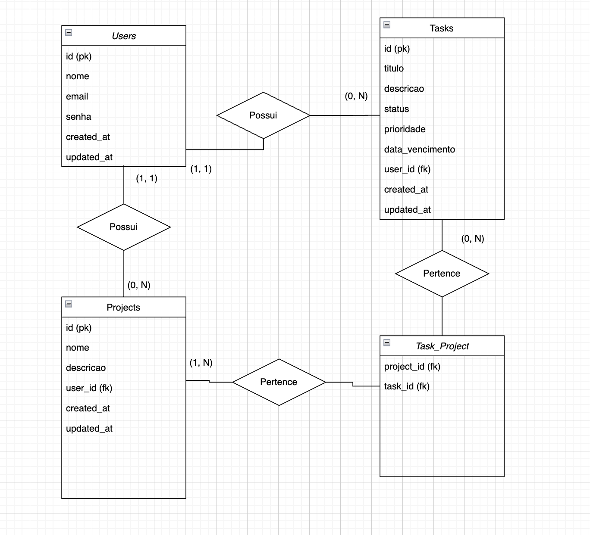

# WAD - Web Application Document - Módulo 2 - Inteli

## Tarefy

#### Autor:

- <a href="https://github.com/obielwb">Gabriel Willian Bartmanovicz</a>

## Sumário

[1. Introdução](#c1)  
[2. Projeto Técnico da Aplicação Web](#c2)

# 1. Introdução

Tarefy é um sistema web de gerenciamento de tarefas projetado para aumentar a produtividade de usuários individuais. Desenvolvido com a arquitetura MVC (Model-View-Controller), o projeto utiliza Node.js com Express.js no backend, PostgreSQL como banco de dados relacional, e EJS para renderização de views no frontend. A aplicação permite que usuários se registrem, façam login, criem e gerenciem tarefas e projetos, com uma interface simples e estilizada.
O objetivo do Tarefy é fornecer uma ferramenta prática para organizar tarefas com atributos como status, prioridade e data de vencimento, além de possibilitar a criação de projetos para agrupar tarefas relacionadas. O sistema foi construído com foco em usabilidade, segurança (autenticação com sessões e senhas criptografadas) e escalabilidade.

# 2. Projeto Técnico da Aplicação Web

## 3.1. Modelagem do banco de dados

  
Fonte: Material produzido pelo autor (2025).

A modelagem do banco de dados do sistema **Tarefy**, um gerenciador de tarefas para produtividade, foi projetada com base em um modelo relacional que reflete as necessidades funcionais da aplicação, garantindo organização, escalabilidade e consistência dos dados. O sistema é estruturado em quatro entidades principais: **Usuários (Users)**, **Tarefas (Tasks)**, **Projetos (Projects)** e **Relação Tarefa-Projeto (Task_Project)**. Cada entidade foi cuidadosamente definida com atributos relevantes e relacionamentos que suportam as funcionalidades de autenticação, gerenciamento de tarefas e organização de projetos, enquanto a tabela de junção `Task_Project` permite associações flexíveis entre tarefas e projetos.

A entidade **Usuários** armazena informações dos usuários do sistema, sendo essencial para a autenticação e personalização. Ela possui os atributos:

- `id` (chave primária, gerada automaticamente)
- `nome` (texto para o nome do usuário)
- `email` (texto único para identificação e login)
- `senha` (texto criptografado para segurança)
- `created_at` e `updated_at` (timestamps para rastrear criação e atualização).

Essa entidade serve como base para associar tarefas e projetos a usuários específicos, garantindo que cada usuário visualize apenas seus próprios dados.

A entidade **Tarefas** é o núcleo do sistema, representando as tarefas que os usuários criam e gerenciam. Seus atributos incluem:

- `id` (chave primária)
- `titulo` (texto obrigatório para descrever a tarefa)
- `descricao` (texto opcional para detalhes)
- `status` (texto com valores padrão como "pendente", podendo ser "em andamento" ou "concluída")
- `prioridade` (texto com valores padrão "média", podendo ser "baixa" ou "alta")
- `data_vencimento` (data opcional para prazos)
- `user_id` (chave estrangeira que referencia a tabela `Users`, associando a tarefa a um usuário)
- `created_at` e `updated_at` (timestamps).

A chave estrangeira `user_id` estabelece uma relação com a tabela `Usuários`, onde um usuário pode ter várias tarefas, mas cada tarefa pertence a apenas um usuário.

A entidade **Projetos** permite que usuários organizem tarefas em grupos lógicos, como iniciativas ou categorias. Seus atributos são:

- `id` (chave primária)
- `nome` (texto obrigatório para identificar o projeto)
- `descricao` (texto opcional)
- `user_id` (chave estrangeira que referencia `Users`)
- `created_at` e `updated_at` (timestamps)

Assim como nas tarefas, a relação com `Usuários` é **um-para-muitos**, com `user_id` vinculando cada projeto a um usuário específico, e a restrição `ON DELETE CASCADE` assegura que a exclusão de um usuário remova seus projetos. Projetos oferecem uma camada adicional de organização, permitindo que tarefas sejam agrupadas por contexto.

A relação entre **Tarefas** e **Projetos** é implementada pela tabela de junção **Task_Project**, que suporta uma relação **muitos-para-muitos**. Essa tabela contém apenas dois atributos:

- `task_id` (chave estrangeira que referencia `Tasks`)
- `project_id` (chave estrangeira que referencia `Projects`)

formando uma chave primária composta `(task_id, project_id)` para evitar duplicatas. As restrições `ON DELETE CASCADE` em ambas as chaves estrangeiras garantem que, se uma tarefa ou projeto for excluído, as associações correspondentes na tabela `Task_Project` sejam automaticamente removidas. Essa estrutura permite que uma tarefa esteja associada a múltiplos projetos e que um projeto contenha várias tarefas, oferecendo flexibilidade na organização.

Essa modelagem suporta as funcionalidades principais do Tarefy, como autenticação de usuários, criação e gerenciamento de tarefas com atributos personalizáveis, organização de projetos e associação flexível entre tarefas e projetos. A escolha de um modelo relacional com chaves estrangeiras e restrições de integridade garante que os dados permaneçam consistentes, enquanto a tabela de junção `Task_Project` permite uma estrutura escalável para futuras expansões, como filtros de tarefas por projeto ou relatórios de produtividade.

## 3.2 Rotas da aplicação

As rotas da aplicação **Tarefy** são organizadas em três módulos principais: **Usuários**, **Tarefas** e **Projetos**. Implementadas utilizando o framework **Express.js**, as rotas seguem a arquitetura MVC e são definidas nos arquivos `routes/userRoutes.js`, `routes/taskRoutes.js` e `routes/projectRoutes.js`. Elas gerenciam as requisições HTTP para autenticação, gerenciamento de tarefas e projetos, além de suportar a associação entre tarefas e projetos. Abaixo, cada conjunto de rotas é explicado em detalhes, incluindo os métodos HTTP, endpoints, funcionalidades e os controladores correspondentes.

### Rotas de Usuários (`userRoutes.js`)

As rotas de usuários lidam com autenticação e gerenciamento de contas, sendo fundamentais para o acesso seguro à aplicação. Elas estão vinculadas ao controlador `UserController` e incluem:

- **GET `/users/register`**: Exibe o formulário de registro de novos usuários. Renderiza a view `user/register.ejs`, permitindo que o usuário insira nome, email e senha. O método `UserController.showRegister` é chamado.
- **POST `/users/register`**: Processa o formulário de registro, criando um novo usuário no banco de dados com senha criptografada (usando bcrypt). Após o sucesso, define a sessão do usuário (`req.session.userId`) e redireciona para `/tasks`. O método `UserController.register` é responsável.
- **GET `/users/login`**: Exibe o formulário de login, renderizando a view `user/login.ejs`. O método `UserController.showLogin` é chamado.
- **POST `/users/login`**: Valida as credenciais do usuário (email e senha). Se válidas, define a sessão (`req.session.userId`) e redireciona para `/tasks`. Caso contrário, exibe uma mensagem de erro na view de login. O método `UserController.login` é usado.
- **GET `/users/logout`**: Encerra a sessão do usuário, destruindo `req.session`, e redireciona para `/users/login`. O método `UserController.logout` é chamado.

Essas rotas garantem que apenas usuários autenticados acessem as funcionalidades de tarefas e projetos, utilizando sessões para manter o estado de login.

### Rotas de Tarefas (`taskRoutes.js`)

As rotas de tarefas gerenciam a criação, listagem, edição e exclusão de tarefas, sendo o núcleo funcional do Tarefy. Elas estão vinculadas ao controlador `TaskController` e exigem autenticação (verificação de `req.session.userId`). As rotas são:

- **GET `/tasks`**: Lista todas as tarefas do usuário logado, renderizando a view `task/list.ejs` com os dados retornados pelo método `TaskController.list`. As tarefas são recuperadas com base no `user_id` da sessão.
- **GET `/tasks/create`**: Exibe o formulário para criar uma nova tarefa, renderizando `task/create.ejs`. Inclui uma lista de projetos do usuário para associação, obtida pelo método `TaskController.showCreate`.
- **POST `/tasks/create`**: Processa o formulário de criação, inserindo a tarefa no banco e associando-a a projetos selecionados (via tabela `task_project`). Redireciona para `/tasks` em caso de sucesso. O método `TaskController.create` é chamado.
- **GET `/tasks/edit/:id`**: Exibe o formulário de edição de uma tarefa específica, identificado pelo parâmetro `:id`. Renderiza `task/edit.ejs` com os dados da tarefa e a lista de projetos, usando `TaskController.showEdit`.
- **POST `/tasks/edit/:id`**: Atualiza os dados da tarefa com base no formulário enviado, incluindo possíveis alterações nas associações com projetos. Redireciona para `/tasks` após a atualização, via `TaskController.edit`.
- **GET `/tasks/delete/:id`**: Exclui a tarefa especificada pelo `:id`, removendo-a do banco (e suas associações na tabela `task_project` devido ao `ON DELETE CASCADE`). Redireciona para `/tasks`, usando `TaskController.delete`.

Essas rotas permitem ao usuário gerenciar suas tarefas de forma completa, com suporte para associar tarefas a projetos, refletindo a relação muitos-para-muitos implementada no banco.

### Rotas de Projetos (`projectRoutes.js`)

As rotas de projetos gerenciam a criação, listagem, edição, exclusão e visualização de tarefas associadas a projetos. Elas estão vinculadas ao controlador `ProjectController` e também exigem autenticação. As rotas são:

- **GET `/projects`**: Lista todos os projetos do usuário logado, renderizando a view `project/list.ejs`. Os projetos são recuperados pelo método `ProjectController.list`.
- **GET `/projects/tasks/:id`**: Exibe as tarefas associadas a um projeto específico, identificado pelo `:id`. Renderiza `project/tasks.ejs` com os dados do projeto e suas tarefas, obtidos por `ProjectController.showTasks`.
- **GET `/projects/create`**: Exibe o formulário para criar um novo projeto, renderizando `project/create.ejs`. O método `ProjectController.showCreate` é chamado.
- **POST `/projects/create`**: Processa o formulário de criação, inserindo o projeto no banco com base no `user_id` da sessão. Redireciona para `/projects`, via `ProjectController.create`.
- **GET `/projects/edit/:id`**: Exibe o formulário de edição de um projeto, identificado pelo `:id`. Renderiza `project/edit.ejs` com os dados do projeto, usando `ProjectController.showEdit`.
- **POST `/projects/edit/:id`**: Atualiza os dados do projeto com base no formulário enviado. Redireciona para `/projects` após a atualização, via `ProjectController.edit`.
- **GET `/projects/delete/:id`**: Exclui o projeto especificado pelo `:id`, removendo-o do banco (e suas associações na tabela `task_project` devido ao `ON DELETE CASCADE`). Redireciona para `/projects`, usando `ProjectController.delete`.

Essas rotas permitem a gestão de projetos e a visualização de tarefas associadas, complementando a funcionalidade de organização do sistema.

### Rota Raiz

Além dos módulos acima, há uma rota raiz definida no arquivo `server.js`:

- **GET `/`**: Redireciona automaticamente para `/users/login`, garantindo que usuários não autenticados sejam encaminhados para a página de login. Essa rota é definida diretamente no `server.js` sem um controlador específico.

As rotas são organizadas em arquivos separados para manter a modularidade e facilitar a manutenção. Cada rota é protegida contra acesso não autorizado, verificando a existência de `req.session.userId` nos controladores correspondentes.
