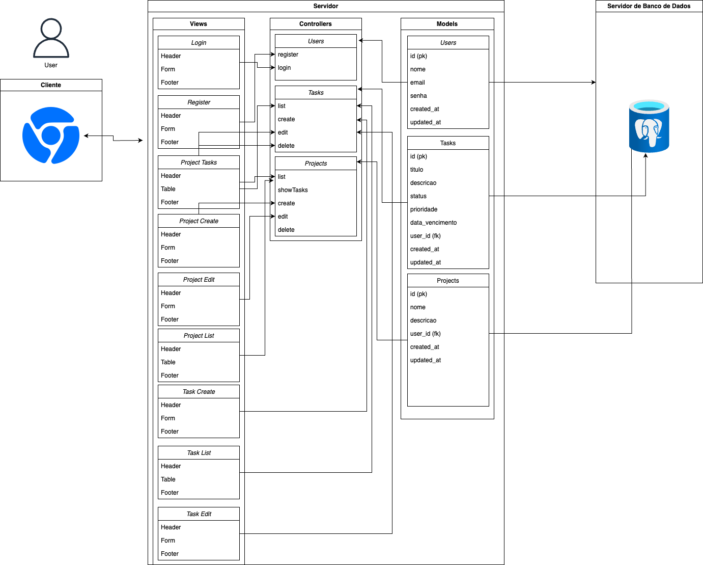
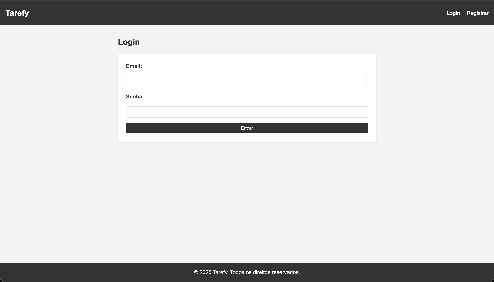
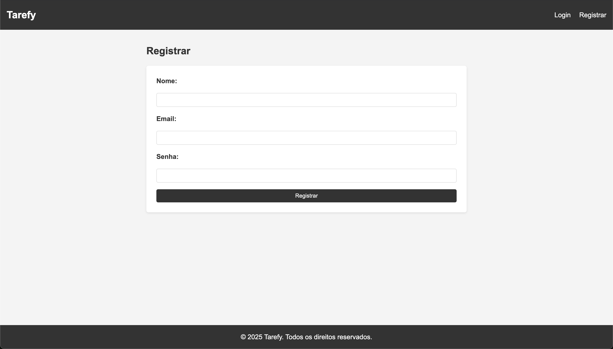
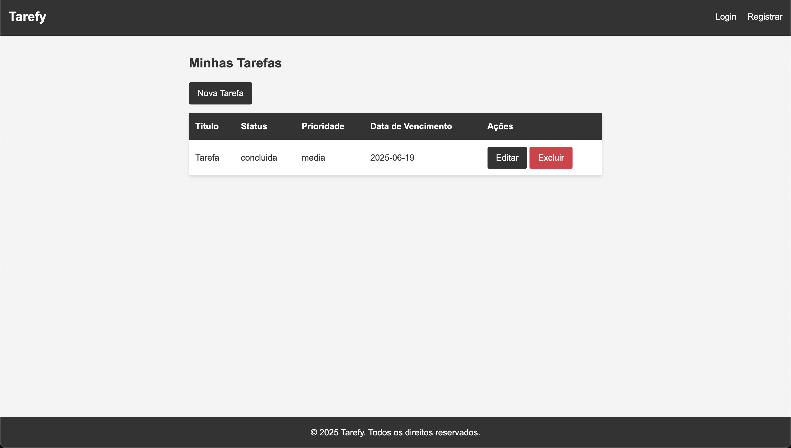
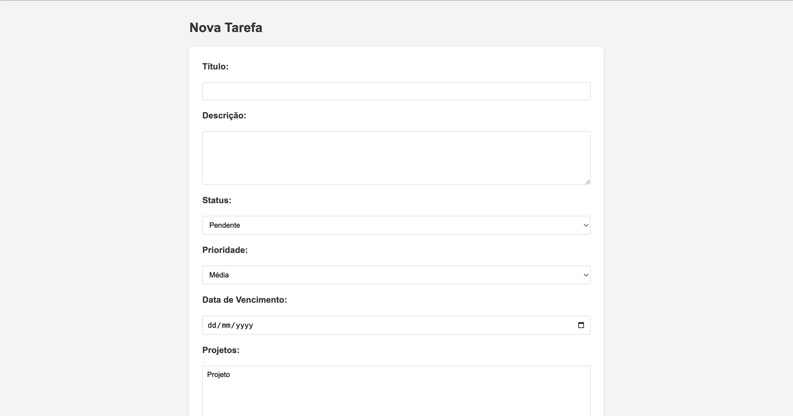
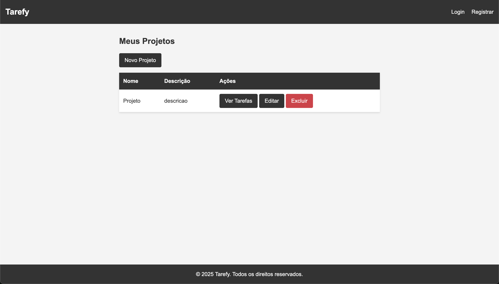
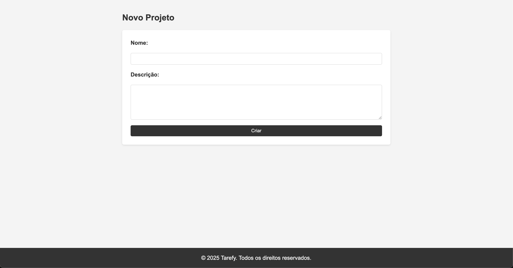

# Web Application Document - Projeto Individual - Módulo 2 - Inteli

## Tarefy

#### Gabriel Willian Bartmanovicz

## Sumário

1. [Introdução](#c1)
2. [Visão Geral da Aplicação Web](#c2)
3. [Projeto Técnico da Aplicação Web](#c3)
4. [Desenvolvimento da Aplicação Web](#c4)
5. [Referências](#c5)

 

## 1. Introdução (Semana 01)

Tarefy é um sistema web de gerenciamento de tarefas projetado para aumentar a produtividade de usuários individuais. Desenvolvido com a arquitetura MVC (Model-View-Controller), o projeto utiliza Node.js com Express.js no backend, PostgreSQL como banco de dados relacional, e EJS para renderização de views no frontend. A aplicação permite que usuários se registrem, façam login, criem e gerenciem tarefas e projetos, com uma interface simples e estilizada.
O objetivo do Tarefy é fornecer uma ferramenta prática para organizar tarefas com atributos como status, prioridade e data de vencimento, além de possibilitar a criação de projetos para agrupar tarefas relacionadas. O sistema foi construído com foco em usabilidade, segurança (autenticação com sessões e senhas criptografadas) e escalabilidade.

---

## 2. Visão Geral da Aplicação Web

### 2.1. Personas (Semana 01 - opcional)

_Posicione aqui sua(s) Persona(s) em forma de texto markdown com imagens, ou como imagem de template preenchido. Atualize esta seção ao longo do módulo se necessário._

### 2.2. User Stories (Semana 01 - opcional)

_Posicione aqui a lista de User Stories levantadas para o projeto. Siga o template de User Stories e utilize a referência USXX para numeração (US01, US02, US03, ...). Indique todas as User Stories mapeadas, mesmo aquelas que não forem implementadas ao longo do projeto. Não se esqueça de explicar o INVEST de 1 User Storie prioritária._

---

## 3. Projeto da Aplicação Web

### 3.1. Modelagem do banco de dados (Semana 3)

  
Fonte: Material produzido pelo autor (2025).

A modelagem do banco de dados do sistema **Tarefy**, um gerenciador de tarefas para produtividade, foi projetada com base em um modelo relacional que reflete as necessidades funcionais da aplicação, garantindo organização, escalabilidade e consistência dos dados. O sistema é estruturado em quatro entidades principais: **Usuários (Users)**, **Tarefas (Tasks)**, **Projetos (Projects)** e **Relação Tarefa-Projeto (Task_Project)**. Cada entidade foi cuidadosamente definida com atributos relevantes e relacionamentos que suportam as funcionalidades de autenticação, gerenciamento de tarefas e organização de projetos, enquanto a tabela de junção `Task_Project` permite associações flexíveis entre tarefas e projetos.

A entidade **Usuários** armazena informações dos usuários do sistema, sendo essencial para a autenticação e personalização. Ela possui os atributos:

- `id` (chave primária, gerada automaticamente)
- `nome` (texto para o nome do usuário)
- `email` (texto único para identificação e login)
- `senha` (texto criptografado para segurança)
- `created_at` e `updated_at` (timestamps para rastrear criação e atualização).

Essa entidade serve como base para associar tarefas e projetos a usuários específicos, garantindo que cada usuário visualize apenas seus próprios dados.

A entidade **Tarefas** é o núcleo do sistema, representando as tarefas que os usuários criam e gerenciam. Seus atributos incluem:

- `id` (chave primária)
- `titulo` (texto obrigatório para descrever a tarefa)
- `descricao` (texto opcional para detalhes)
- `status` (texto com valores padrão como "pendente", podendo ser "em andamento" ou "concluída")
- `prioridade` (texto com valores padrão "média", podendo ser "baixa" ou "alta")
- `data_vencimento` (data opcional para prazos)
- `user_id` (chave estrangeira que referencia a tabela `Users`, associando a tarefa a um usuário)
- `created_at` e `updated_at` (timestamps).

A chave estrangeira `user_id` estabelece uma relação com a tabela `Usuários`, onde um usuário pode ter várias tarefas, mas cada tarefa pertence a apenas um usuário.

A entidade **Projetos** permite que usuários organizem tarefas em grupos lógicos, como iniciativas ou categorias. Seus atributos são:

- `id` (chave primária)
- `nome` (texto obrigatório para identificar o projeto)
- `descricao` (texto opcional)
- `user_id` (chave estrangeira que referencia `Users`)
- `created_at` e `updated_at` (timestamps)

Assim como nas tarefas, a relação com `Usuários` é **um-para-muitos**, com `user_id` vinculando cada projeto a um usuário específico, e a restrição `ON DELETE CASCADE` assegura que a exclusão de um usuário remova seus projetos. Projetos oferecem uma camada adicional de organização, permitindo que tarefas sejam agrupadas por contexto.

A relação entre **Tarefas** e **Projetos** é implementada pela tabela de junção **Task_Project**, que suporta uma relação **muitos-para-muitos**. Essa tabela contém apenas dois atributos:

- `task_id` (chave estrangeira que referencia `Tasks`)
- `project_id` (chave estrangeira que referencia `Projects`)

formando uma chave primária composta `(task_id, project_id)` para evitar duplicatas. As restrições `ON DELETE CASCADE` em ambas as chaves estrangeiras garantem que, se uma tarefa ou projeto for excluído, as associações correspondentes na tabela `Task_Project` sejam automaticamente removidas. Essa estrutura permite que uma tarefa esteja associada a múltiplos projetos e que um projeto contenha várias tarefas, oferecendo flexibilidade na organização.

Essa modelagem suporta as funcionalidades principais do Tarefy, como autenticação de usuários, criação e gerenciamento de tarefas com atributos personalizáveis, organização de projetos e associação flexível entre tarefas e projetos. A escolha de um modelo relacional com chaves estrangeiras e restrições de integridade garante que os dados permaneçam consistentes, enquanto a tabela de junção `Task_Project` permite uma estrutura escalável para futuras expansões, como filtros de tarefas por projeto ou relatórios de produtividade.

### 3.1.1 BD e Models (Semana 5)

Os **Models** do sistema **Tarefy** foram implementados em JavaScript utilizando o framework **Node.js** com **Express.js** e o banco de dados **PostgreSQL**, seguindo a arquitetura MVC. Eles representam as entidades do banco de dados (`Users`, `Tasks`, `Projects` e `Task_Project`) e encapsulam a lógica de acesso e manipulação de dados, utilizando o módulo `pg` para interagir com o banco via conexão configurada em `config/database.js`. Abaixo, cada model é descrito com base no código fornecido, destacando suas responsabilidades e métodos.

#### Model `User`

O model `User` gerencia a entidade **Usuários**, responsável por autenticação e armazenamento de dados do usuário. Ele utiliza a biblioteca `bcrypt` para criptografia de senhas, garantindo segurança. Seus métodos são:

- **`create({ nome, email, senha })`**: Cria um novo usuário no banco, criptografando a senha com `bcrypt` (10 rodadas de hash). Insere `nome`, `email` e `senha` na tabela `users` e retorna o `id`, `nome` e `email` do usuário criado.
- **`findByEmail(email)`**: Busca um usuário pelo `email` na tabela `users`, retornando todos os atributos (incluindo `senha` para validação no login).

Esse model suporta as funcionalidades de registro e login, sendo essencial para autenticação e associação de tarefas/projetos a usuários específicos.

#### Model `Task`

O model `Task` gerencia a entidade **Tarefas**, o núcleo funcional do sistema, e lida com a criação, listagem, atualização, exclusão e associação de tarefas a projetos. Ele utiliza transações para garantir consistência ao manipular a tabela `task_project`. Seus métodos são:

- **`create({ titulo, descricao, status, prioridade, data_vencimento, user_id, project_ids })`**: Cria uma nova tarefa na tabela `tasks` e, se fornecido, associa-a a projetos na tabela `task_project`. Usa uma transação para garantir que a tarefa e suas associações sejam salvas atomicamente. Retorna a tarefa criada.
- **`findByUserId(user_id)`**: Recupera todas as tarefas de um usuário, incluindo os `project_ids` associados (via `array_agg` na tabela `task_project`). Usa `LEFT JOIN` para incluir tarefas sem projetos.
- **`findById(id)`**: Busca uma tarefa específica pelo `id`, retornando seus atributos e os `project_ids` associados.
- **`update(id, { titulo, descricao, status, prioridade, data_vencimento, project_ids })`**: Atualiza uma tarefa existente, modificando seus atributos e recriando as associações com projetos (remove as antigas e adiciona as novas). Usa uma transação para consistência.
- **`delete(id)`**: Exclui uma tarefa pelo `id`. As associações em `task_project` são automaticamente removidas devido à restrição `ON DELETE CASCADE`.
- **`findByProjectId(project_id)`**: Recupera todas as tarefas associadas a um projeto específico, usando um `JOIN` com a tabela `task_project`.

Esse model suporta as operações CRUD de tarefas e a relação muitos-para-muitos com projetos, garantindo flexibilidade na organização.

### Model `Project`

O model `Project` gerencia a entidade **Projetos**, permitindo a criação e organização de grupos de tarefas. Seus métodos são:

- **`create({ nome, descricao, user_id })`**: Cria um novo projeto na tabela `projects`, associado a um `user_id`. Retorna o projeto criado.
- **`findByUserId(user_id)`**: Lista todos os projetos de um usuário específico.
- **`findById(id)`**: Busca um projeto pelo `id`, retornando seus atributos.
- **`update(id, { nome, descricao })`**: Atualiza os atributos `nome` e `descricao` de um projeto, atualizando também o `updated_at`.
- **`delete(id)`**: Exclui um projeto pelo `id`. As associações em `task_project` são removidas automaticamente via `ON DELETE CASCADE`.

Esse model suporta a gestão de projetos e sua integração com tarefas, permitindo que usuários organizem suas atividades em grupos lógicos.

#### Integração com o Banco de Dados

Os models utilizam o objeto `pool` (definido em `config/database.js`) para executar consultas SQL no **PostgreSQL**. As queries são parametrizadas para prevenir injeção de SQL, e transações são usadas em operações complexas (como em `Task.create` e `Task.update`) para garantir consistência. A relação muitos-para-muitos entre `Tasks` e `Projects` é gerenciada pela tabela `task_project`, com restrições de integridade (`ON DELETE CASCADE`) que simplificam a exclusão de dados relacionados.

### 3.2. Arquitetura (Semana 5)

A arquitetura do sistema **Tarefy** é baseada no padrão **MVC (Model-View-Controller)**, que separa a lógica de negócios, a apresentação e o controle de fluxo da aplicação. Essa abordagem modular facilita a manutenção e escalabilidade do código, permitindo que diferentes partes do sistema sejam desenvolvidas e testadas de forma independente.

Abaixo está uma representação visual da arquitetura do sistema:

  
Fonte: Material produzido pelo autor (2025).

### 3.3. Wireframes (Semana 03 - opcional)

_Posicione aqui as imagens do wireframe construído para sua solução e, opcionalmente, o link para acesso (mantenha o link sempre público para visualização)._

### 3.4. Guia de estilos (Semana 05 - opcional)

_Descreva aqui orientações gerais para o leitor sobre como utilizar os componentes do guia de estilos de sua solução._

### 3.5. Protótipo de alta fidelidade (Semana 05 - opcional)

_Posicione aqui algumas imagens demonstrativas de seu protótipo de alta fidelidade e o link para acesso ao protótipo completo (mantenha o link sempre público para visualização)._

### 3.6. WebAPI e endpoints (Semana 05)

As rotas da aplicação **Tarefy** são organizadas em três módulos principais: **Usuários**, **Tarefas** e **Projetos**. Implementadas utilizando o framework **Express.js**, as rotas seguem a arquitetura MVC e são definidas nos arquivos `routes/userRoutes.js`, `routes/taskRoutes.js` e `routes/projectRoutes.js`. Elas gerenciam as requisições HTTP para autenticação, gerenciamento de tarefas e projetos, além de suportar a associação entre tarefas e projetos. Abaixo, cada conjunto de rotas é explicado em detalhes, incluindo os métodos HTTP, endpoints, funcionalidades e os controladores correspondentes.

#### Rotas de Usuários (`userRoutes.js`)

As rotas de usuários lidam com autenticação e gerenciamento de contas, sendo fundamentais para o acesso seguro à aplicação. Elas estão vinculadas ao controlador `UserController` e incluem:

- **GET `/users/register`**: Exibe o formulário de registro de novos usuários. Renderiza a view `user/register.ejs`, permitindo que o usuário insira nome, email e senha. O método `UserController.showRegister` é chamado.
- **POST `/users/register`**: Processa o formulário de registro, criando um novo usuário no banco de dados com senha criptografada (usando bcrypt). Após o sucesso, define a sessão do usuário (`req.session.userId`) e redireciona para `/tasks`. O método `UserController.register` é responsável.
- **GET `/users/login`**: Exibe o formulário de login, renderizando a view `user/login.ejs`. O método `UserController.showLogin` é chamado.
- **POST `/users/login`**: Valida as credenciais do usuário (email e senha). Se válidas, define a sessão (`req.session.userId`) e redireciona para `/tasks`. Caso contrário, exibe uma mensagem de erro na view de login. O método `UserController.login` é usado.
- **GET `/users/logout`**: Encerra a sessão do usuário, destruindo `req.session`, e redireciona para `/users/login`. O método `UserController.logout` é chamado.

Essas rotas garantem que apenas usuários autenticados acessem as funcionalidades de tarefas e projetos, utilizando sessões para manter o estado de login.

#### Rotas de Tarefas (`taskRoutes.js`)

As rotas de tarefas gerenciam a criação, listagem, edição e exclusão de tarefas, sendo o núcleo funcional do Tarefy. Elas estão vinculadas ao controlador `TaskController` e exigem autenticação (verificação de `req.session.userId`). As rotas são:

- **GET `/tasks`**: Lista todas as tarefas do usuário logado, renderizando a view `task/list.ejs` com os dados retornados pelo método `TaskController.list`. As tarefas são recuperadas com base no `user_id` da sessão.
- **GET `/tasks/create`**: Exibe o formulário para criar uma nova tarefa, renderizando `task/create.ejs`. Inclui uma lista de projetos do usuário para associação, obtida pelo método `TaskController.showCreate`.
- **POST `/tasks/create`**: Processa o formulário de criação, inserindo a tarefa no banco e associando-a a projetos selecionados (via tabela `task_project`). Redireciona para `/tasks` em caso de sucesso. O método `TaskController.create` é chamado.
- **GET `/tasks/edit/:id`**: Exibe o formulário de edição de uma tarefa específica, identificado pelo parâmetro `:id`. Renderiza `task/edit.ejs` com os dados da tarefa e a lista de projetos, usando `TaskController.showEdit`.
- **POST `/tasks/edit/:id`**: Atualiza os dados da tarefa com base no formulário enviado, incluindo possíveis alterações nas associações com projetos. Redireciona para `/tasks` após a atualização, via `TaskController.edit`.
- **GET `/tasks/delete/:id`**: Exclui a tarefa especificada pelo `:id`, removendo-a do banco (e suas associações na tabela `task_project` devido ao `ON DELETE CASCADE`). Redireciona para `/tasks`, usando `TaskController.delete`.

Essas rotas permitem ao usuário gerenciar suas tarefas de forma completa, com suporte para associar tarefas a projetos, refletindo a relação muitos-para-muitos implementada no banco.

#### Rotas de Projetos (`projectRoutes.js`)

As rotas de projetos gerenciam a criação, listagem, edição, exclusão e visualização de tarefas associadas a projetos. Elas estão vinculadas ao controlador `ProjectController` e também exigem autenticação. As rotas são:

- **GET `/projects`**: Lista todos os projetos do usuário logado, renderizando a view `project/list.ejs`. Os projetos são recuperados pelo método `ProjectController.list`.
- **GET `/projects/tasks/:id`**: Exibe as tarefas associadas a um projeto específico, identificado pelo `:id`. Renderiza `project/tasks.ejs` com os dados do projeto e suas tarefas, obtidos por `ProjectController.showTasks`.
- **GET `/projects/create`**: Exibe o formulário para criar um novo projeto, renderizando `project/create.ejs`. O método `ProjectController.showCreate` é chamado.
- **POST `/projects/create`**: Processa o formulário de criação, inserindo o projeto no banco com base no `user_id` da sessão. Redireciona para `/projects`, via `ProjectController.create`.
- **GET `/projects/edit/:id`**: Exibe o formulário de edição de um projeto, identificado pelo `:id`. Renderiza `project/edit.ejs` com os dados do projeto, usando `ProjectController.showEdit`.
- **POST `/projects/edit/:id`**: Atualiza os dados do projeto com base no formulário enviado. Redireciona para `/projects` após a atualização, via `ProjectController.edit`.
- **GET `/projects/delete/:id`**: Exclui o projeto especificado pelo `:id`, removendo-o do banco (e suas associações na tabela `task_project` devido ao `ON DELETE CASCADE`). Redireciona para `/projects`, usando `ProjectController.delete`.

Essas rotas permitem a gestão de projetos e a visualização de tarefas associadas, complementando a funcionalidade de organização do sistema.

#### Rota Raiz

Além dos módulos acima, há uma rota raiz definida no arquivo `server.js`:

- **GET `/`**: Redireciona automaticamente para `/users/login`, garantindo que usuários não autenticados sejam encaminhados para a página de login. Essa rota é definida diretamente no `server.js` sem um controlador específico.

As rotas são organizadas em arquivos separados para manter a modularidade e facilitar a manutenção. Cada rota é protegida contra acesso não autorizado, verificando a existência de `req.session.userId` nos controladores correspondentes.

### 3.7 Interface e Navegação (Semana 07)

A interface do sistema **Tarefy** foi desenvolvida utilizando o mecanismo de templates **EJS** (Embedded JavaScript), que permite a renderização dinâmica de views no lado do servidor. A estrutura de pastas para as views é organizada em `views/`, com subpastas para cada módulo principal: `user`, `task` e `project`. Cada view é responsável por exibir informações específicas e interagir com o usuário, utilizando HTML, CSS e EJS para incorporar lógica de apresentação.

As views são renderizadas pelos controladores correspondentes, que processam os dados necessários e os passam para as templates EJS. Abaixo estão as telas principais do sistema:

Tela de Login
  
Fonte: Material produzido pelo autor (2025).

Tela de Registro
  
Fonte: Material produzido pelo autor (2025).

Tela de Listagem de Tarefas
  
Fonte: Material produzido pelo autor (2025).

Tela de Criação de Tarefas
  
Fonte: Material produzido pelo autor (2025).

Tela de Listagem de Projetos
  
Fonte: Material produzido pelo autor (2025).

Tela de Criação de Projetos
  
Fonte: Material produzido pelo autor (2025).

---

## 4. Desenvolvimento da Aplicação Web (Semana 8)

### 4.1 Demonstração do Sistema Web (Semana 8)

Vídeo de demonstração do sistema web completo:  
https://www.loom.com/share/cc729a58ea934ec997e26db1a96fa0fc?sid=82c0b62e-b9ed-48a2-b7ff-fd08a68bee36

### 4.2 Conclusões e Trabalhos Futuros (Semana 8)

O sistema **Tarefy** foi desenvolvido com sucesso, implementando as principais funcionalidades de gerenciamento de tarefas e projetos. A arquitetura MVC garantiu uma separação clara entre a lógica de negócios, a apresentação e o controle de fluxo, facilitando a manutenção e escalabilidade do código. O uso de PostgreSQL como banco de dados relacional proporcionou uma estrutura robusta para armazenar usuários, tarefas e projetos, com suporte a relacionamentos muitos-para-muitos.

O sistema foi testado para garantir que todas as funcionalidades atendam aos requisitos iniciais, incluindo autenticação de usuários, criação e gerenciamento de tarefas e projetos, e a associação entre eles. A interface web foi desenvolvida utilizando EJS para renderização dinâmica de views, proporcionando uma experiência de usuário intuitiva e responsiva.

O projeto também incorporou boas práticas de segurança, como criptografia de senhas com bcrypt e gerenciamento de sessões para autenticação. A documentação foi elaborada para facilitar a compreensão do sistema, incluindo a modelagem do banco de dados, a arquitetura MVC, as rotas da WebAPI e a interface do usuário.

### Trabalhos Futuros

Para trabalhos futuros, algumas melhorias e funcionalidades adicionais podem ser consideradas:

- **Implementação de Notificações**: Adicionar notificações para lembrar os usuários sobre tarefas pendentes ou próximas datas de vencimento.
- **Filtros e Busca Avançada**: Implementar filtros para visualizar tarefas por status, prioridade ou data de vencimento, além de uma funcionalidade de busca por título ou descrição.
- **Exportação de Dados**: Permitir que usuários exportem suas tarefas e projetos em formatos como CSV ou PDF para relatórios.
- **Integração com APIs Externas**: Explorar integrações com serviços externos, como calendários (Google Calendar) ou ferramentas de produtividade (Trello, Asana).

## 5. Referências

- **Documentação do Node.js**: https://nodejs.org/en/docs/
- **Documentação do Express.js**: https://expressjs.com/
- **Documentação do PostgreSQL**: https://www.postgresql.org/docs/

---
